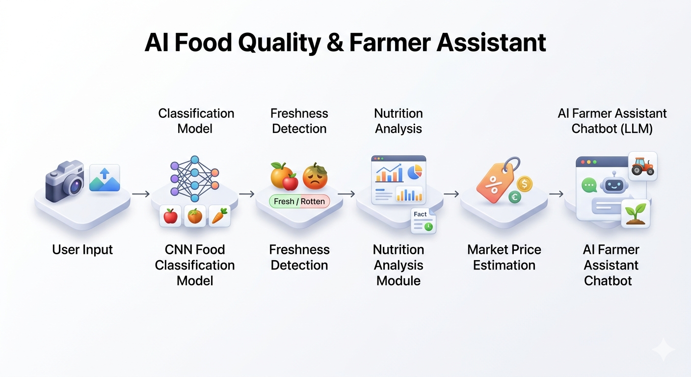
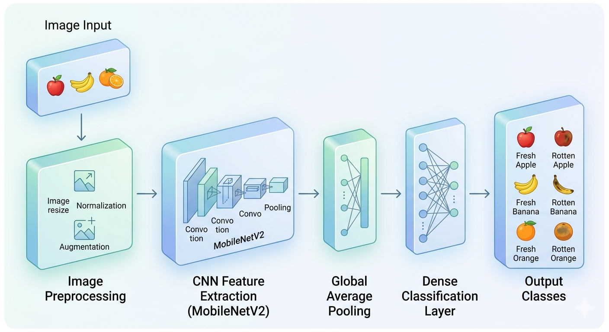
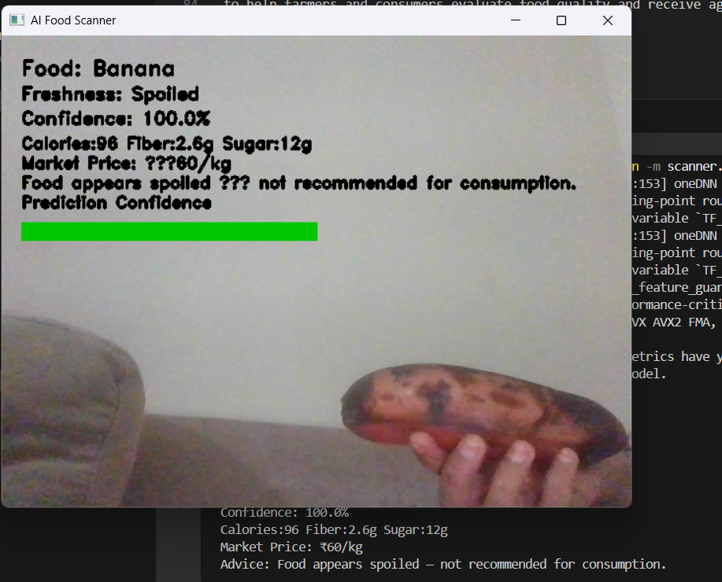
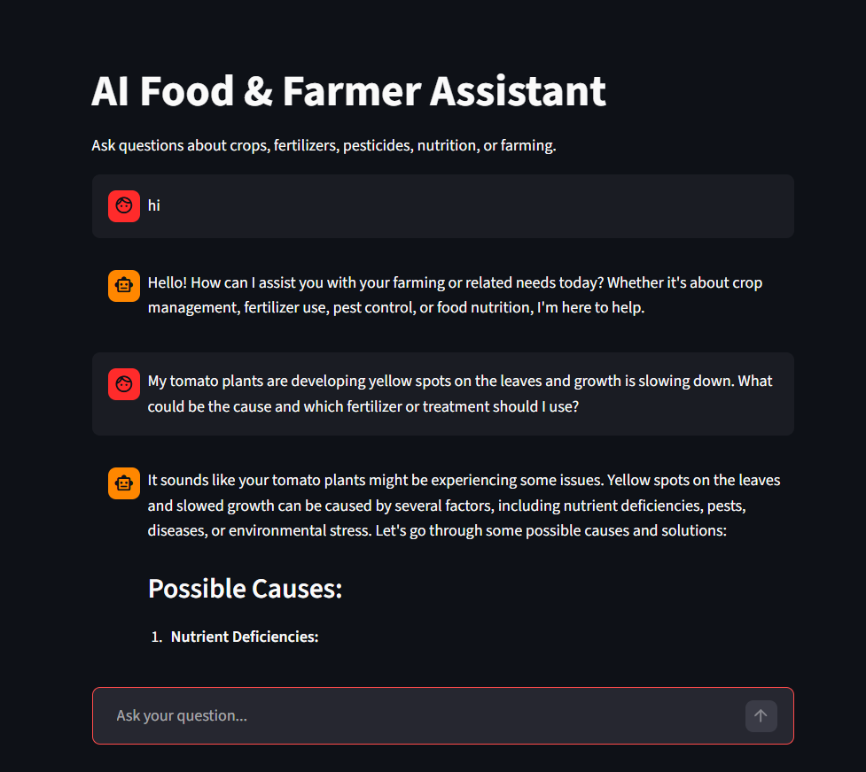

# AI Food Quality & Farmer Assistant

An AI-powered system for **food freshness detection, nutritional analysis, market price estimation, and agricultural assistance**.

The project integrates **Computer Vision (CNN models)** with **Large Language Models (LLMs)** to create an intelligent system capable of assisting both **consumers and farmers**.

---

# Overview

This project demonstrates how modern AI techniques can be applied to agricultural and food systems.

The platform includes:

- Food freshness detection using a CNN model
- Nutrition analysis of detected food items
- Market price estimation for produce
- AI-powered farmer assistant chatbot

---

# System Architecture

The system integrates computer vision and language models into a unified pipeline.




---

# Model Pipeline

The machine learning pipeline used for training and inference.




---

# Model Benchmark Analysis

To evaluate deployment efficiency, we analyze the **trade-off between model accuracy and computational cost**.

The visualization below shows the relationship between **model latency / size and classification accuracy**.


Models compared:

| Model | Accuracy | Latency | Use Case |
|------|---------|---------|---------|
| MobileNetV2 | High | Low | Edge devices |
| Quantized MobileNetV2 | Moderate | Very Low | Mobile deployment |
| ResNet50 | Very High | High | High compute environments |

This analysis highlights why **lightweight CNN architectures are ideal for real-time food quality detection**.

---

# Example Outputs

### Food Freshness Detection

After scanning an image, the system predicts the food type, freshness status, and nutritional information.



Example information returned:

- Food Type
- Fresh / Spoiled status
- Confidence score
- Nutritional values
- Estimated market price

---

### AI Farmer Assistant

The system also includes an AI-powered assistant capable of answering agricultural questions.



Farmers can ask questions such as:

- Which fertilizer should be used for rice crops?
- How to prevent pest infections?
- Best storage practices for fruits

---

# Key Features

| Feature | Description |
|------|-------------|
| Food Freshness Detection | CNN-based classification of fruits as fresh or spoiled |
| Nutrition Analysis | Displays calorie, sugar, and fiber information |
| Market Price Estimation | Provides approximate produce market value |
| AI Farmer Assistant | LLM-powered chatbot for agricultural advice |
| Real-Time Camera Scanner | Detects food freshness using webcam input |

---

# Dataset

Dataset used for training the model:

**Fruit Freshness Dataset**

Classes included:

| Class |
|------|
| freshapple |
| rottenapple |
| freshbanana |
| rottenbanana |
| freshorange |
| rottenorange |

Total classes: **6**

---

# Model Details

CNN Architecture:
MobileNetV2 Backbone
Global Average Pooling
Dense Layer
Softmax Output


Advantages:

- Lightweight architecture
- Efficient inference
- Suitable for edge deployment

---

# Installation

Clone the repository:

```bash
git clone https://github.com/YOUR_USERNAME/food-quality-ai.git
cd food-quality-ai

Install dependencies:
pip install -r requirements.txt

Running the Application

Launch the Streamlit interface:
streamlit run app.py
The application will open in your browser.

Environment Setup

Create a file:

.streamlit/secrets.toml

Add your HuggingFace API token:

HF_TOKEN="your_huggingface_token"
```
# Future Improvements

- Potential future extensions include:
- More fruit and vegetable classes
- Disease detection in crops
- Multilingual farmer assistant
- Mobile application deployment

# Research Applications

- This project demonstrates practical applications of:
- Computer Vision in agriculture
- Edge AI model optimization
- Multi-module AI systems
- AI-assisted decision support for farmers

## Author
Shaik Hasna - 
Artificial Intelligence & Data Science Graduate
